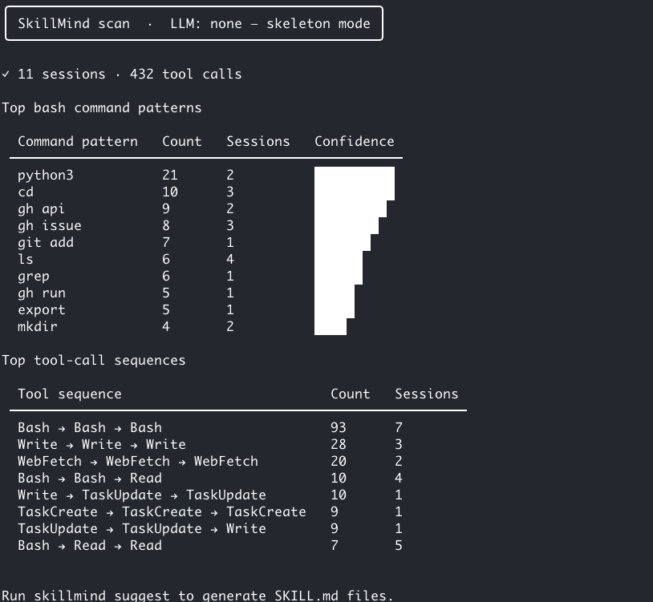

# SkillMind

> Detect reusable skills from your Claude Code sessions and turn them into `SKILL.md` files automatically.

SKILL.md is an [open standard](https://agentskills.io) supported by 40+ AI coding agents — Claude Code, Cursor, Copilot, Gemini CLI, and more. SkillMind watches your sessions and writes the skills for you.

## Install

```bash
git clone https://github.com/gocoolp/skillmind
cd skillmind
uv sync
```

## Usage

```bash
# Step 1 — see what patterns exist in your sessions (no API key needed)
uv run skillmind scan

# Step 2 — generate SKILL.md files from those patterns
uv run skillmind suggest --output ./skills --top-n 5
```



**Example output:** see [`examples/gh-api.skill.md`](examples/gh-api.skill.md) for what a generated skill looks like.

## LLM backends

Set an API key to get AI-drafted skill content. Without one, SkillMind generates skeleton files you can fill in manually.

| Env var | Backend |
|---|---|
| `ANTHROPIC_API_KEY` | Claude (recommended) |
| `OPENAI_API_KEY` + `OPENAI_BASE_URL` | OpenAI or Azure |
| `SKILLMIND_OLLAMA` | Local Ollama |
| *(none)* | Skeleton mode — fully offline |

## How it works

1. Reads your existing `~/.claude/projects/**/*.jsonl` session logs
2. Detects recurring bash command patterns and tool-call sequences
3. Generates a `SKILL.md` per pattern — ready to drop into any agent

Everything stays local. No session data leaves your machine.

## License

MIT
